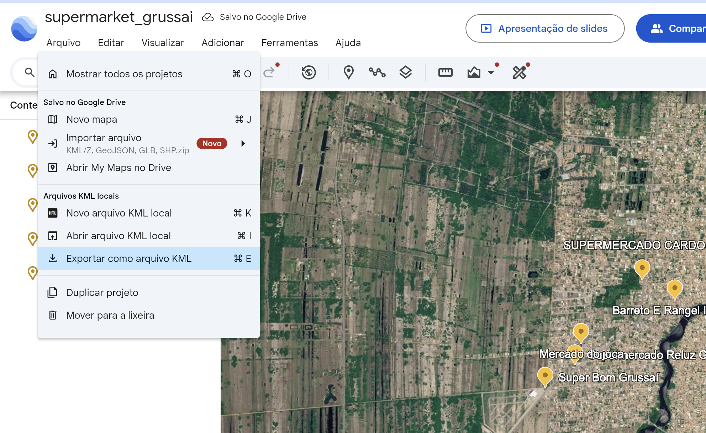

```{r, include = FALSE}
knitr::opts_chunk$set(
  collapse = TRUE,
  comment = "#>"
)
```

```{r setup, eval = TRUE}
library(dplyr)
library(sf)
library(tmap)
library(geomarkbr)
tmap::tmap_mode("plot")
```

# Pontos de Interesse: OpenStreetMap e Google Maps

::: {.callout-note collapse="true"}
## 🤓 Código de desenvolvimento (dev)

```{r, echo = TRUE, eval = FALSE}
# dev: ler os setores censitários e salvar como rds
setores_rj <- gm_read_sectors_data(code = 33)|>
  dplyr::mutate(code_tract = as.character(code_tract))

dados_pf = "site/tutorials/dados/"

readr::write_sf(setores_rj,
                paste0(dadps_pf,"shape_rj.gpkg"), 
                overwrite = TRUE)

```

```{r echo = TRUE, eval = FALSE}
limites_sjb = geobr::read_municipality(2022, code_muni = 3305000)
limites_campos = geobr::read_municipality(2022, code_muni = 3301009)
setores_campos = geobr::read_census_tract(code_tract = 3301009, year = 2022)
setores_1stsubdistrict_campos = setores_campos %>%
  dplyr::filter(code_subdistrict == 33010090506)


sf::write_sf(setores_1stsubdistrict_campos,
                paste0(dados_pf,"setores_1stsubdistrict_campos.gpkg"), 
                overwrite = TRUE)
sf::write_sf(setores_campos,
                paste0(dados_pf,"setores_campos.gpkg"), 
                overwrite = TRUE)
sf::write_sf(limites_campos,
                paste0(dados_pf,"limites_campos.gpkg"), 
                overwrite = TRUE)
sf::write_sf(limites_sjb,
                paste0(dados_pf,"limites_sjb.gpkg"), 
                overwrite = TRUE)

bbox_sjb <- sf::st_bbox(limites_sjb)
bbox_campos <- sf::st_bbox(limites_campos)
bbox_1stsubdistrict_campos <- sf::st_bbox(setores_1stsubdistrict_campos)
```


```{r eval = FALSE, echo = TRUE}
# dev: baixar pontos de interesse do OSM


baixa_pois = function(bbox){
  endpoints <- c(
    "https://overpass-api.de/api/interpreter",
    "https://overpass.kumi.systems/api/interpreter",
    "https://api.openstreetmap.fr/oapi/interpreter",
    "https://overpass.osm.vi-di.fr/api/interpreter"
  )
  
  osm_pois <- NULL
  
  for (ep in endpoints) {
    message("Tentando endpoint: ", ep)
    
    ok <- tryCatch(
      {
        osmdata::set_overpass_url(ep)
        TRUE
      },
      error = function(e) {
        message("Falhou ao definir endpoint: ", conditionMessage(e))
        FALSE
      }
    )
    
    if (!ok) next
    
    osm_pois <- tryCatch(
      {
        osmdata::opq(
          bbox = bbox,
          timeout = 300
        ) |>
          osmdata::add_osm_feature(key = "amenity") |>
          osmdata::osmdata_sf()
      },
      error = function(e) {
        message("Falhou na consulta: ", conditionMessage(e))
        NULL
      }
    )
    
    if (!is.null(osm_pois)) break
  }
  return(list(osm_pois=osm_pois,
              pois_points = osm_pois$osm_points,
              pois_polygons = osm_pois$osm_polygons))
}

osm_pois_1stsubdistrict_campos = baixa_pois(bbox_1stsubdistrict_campos)
readr::write_rds(
  osm_pois_1stsubdistrict_campos$osm_pois, "site/tutorials/dados/osm_pois_1stsubdistrict_campos.rds")
sf::write_sf(
  osm_pois_1stsubdistrict_campos$pois_points,
  "inst/extdata/osm_pois_1stsubdistrict_campos_points.gpkg",
  delete_dsn = TRUE)
sf::write_sf(
  osm_pois_1stsubdistrict_campos$pois_polygons,
  "inst/extdata/osm_pois_1stsubdistrict_campos_polygons.gpkg",
  delete_dsn = TRUE)

osm_pois_campos = baixa_pois(bbox_campos)
readr::write_rds(
  osm_pois_campos$osm_pois, "site/tutorials/dados/osm_pois_campos.rds")
sf::write_sf(
  osm_pois_campos$pois_points,
  "inst/extdata/osm_pois_campos_points.gpkg",
  delete_dsn = TRUE)
sf::write_sf(
  osm_pois_campos$pois_polygons,
  "inst/extdata/osm_pois_campos_polygons.gpkg",
  delete_dsn = TRUE)


osm_pois_sjb = baixa_pois(bbox_sjb)
readr::write_rds(
  osm_pois_sjb$osm_pois, "site/tutorials/dados/osm_pois_sjb.rds")
sf::write_sf(
  osm_pois_sjb$pois_polygons,
  "inst/extdata/osm_pois_sjb_polygons.gpkg",
  delete_dsn = TRUE)
sf::write_sf(
  osm_pois_sjb$pois_points,
  "inst/extdata/osm_pois_sjb_points.gpkg",
  delete_dsn = TRUE)


```

:::

## Por que usar OpenStreetMap?

O OpenStreetMap [@openstreetmapfoundation2023] é uma base de dados geográficos colaborativa e aberta, construída por voluntários ao redor do mundo. Seu funcionamento é frequentemente comparado ao da Wikipédia [@wikipedia2023c]: qualquer pessoa pode editar, corrigir ou adicionar informações espaciais. Isso faz com que o OSM seja constantemente atualizado e particularmente útil em aplicações urbanas e regionais.

Os dados do OSM incluem uma enorme variedade de elementos espaciais, como vias, ciclovias, escolas, hospitais, farmácias, pontos de ônibus, comércios, áreas verdes e equipamentos urbanos em geral. Essas informações podem complementar os dados do Censo Demográfico, permitindo análises mais detalhadas da infraestrutura urbana, da acessibilidade e da distribuição espacial de serviços.

Uma das grandes vantagens do OSM é sua flexibilidade. Diferentemente de muitas bases oficiais, os dados podem ser baixados diretamente no R e filtrados por categorias específicas, chamadas de *tags*. Isso permite, por exemplo, mapear apenas escolas, supermercados ou vias arteriais de uma cidade.

Entretanto, os dados do OSM também possuem limitações importantes. Como o mapeamento é colaborativo, a cobertura e a qualidade das informações variam bastante conforme o local. Áreas centrais e cidades maiores tendem a possuir dados mais completos, enquanto municípios pequenos ou regiões periféricas podem apresentar lacunas, inconsistências ou classificações diferentes para elementos semelhantes. Por isso, os dados do OSM devem sempre ser analisados de forma crítica e, quando possível, comparados com outras fontes de informação.

## Baixar dados do OpenStreetMap

Para consultar dados do OpenStreetMap, precisamos primeiro definir uma área de interesse. Nesta aula, essa área será construída a partir dos setores censitários de São João da Barra. A ideia é usar a própria geometria do município como referência espacial para buscar, no OSM, elementos que estejam dentro ou próximos dessa área.

O pacote `osmdata` trabalha frequentemente com uma **bounding box**, isto é, um retângulo que envolve a área de interesse. Esse retângulo é definido pelos limites mínimo e máximo de longitude e latitude. Embora a área real do município tenha forma irregular, a bounding box fornece uma forma simples e eficiente de delimitar a consulta inicial ao OSM.

```{r}

dados_pf = here::here('tutorials/dados/') # substitua pelo caminho da aula_geomarketing
                                          # Acho que '~/aula_geomarketing/data' funciona
setores <- gm_read_sectors_shape(
  path = paste0(dados_pf,"limites_sjb.gpkg"),
  code = 3305000
)

# Garantir que a base está em latitude/longitude (WGS84)
setores_ll <- sf::st_transform(setores, 4326)

# Criar a bounding box da área de estudo
bbox <- sf::st_bbox(setores_ll)

bbox
```

Com a bounding box definida, podemos montar uma consulta ao OpenStreetMap. A consulta é formada por duas partes principais: a área de busca e a tag que queremos recuperar. No exemplo abaixo, vamos buscar pontos de interesse classificados como `amenity`, uma chave bastante usada no OSM para representar equipamentos e serviços, como escolas, hospitais, farmácias, restaurantes e bancos.


```{r eval=FALSE}
osm_pois <- osmdata::opq(
  bbox = bbox,
  timeout = 180
) |>
  osmdata::add_osm_feature(
    key = "amenity"
  ) |>
  osmdata::osmdata_sf()

pois_points <- osm_pois$osm_points
pois_polygons <- osm_pois$osm_polygons

```

Esse comando, muito frequentemente, retorna erros *HTTP 504 Gateway Timeout* ou *HTTP 429 Too Many Requests*. Isso ainda é mais frequente em ambiente de laboratórios de ensino. Outras vezes o erro é do servidor mesmo: o servidor padrão às vezes fica lento ou indisponível. O osmdata prevê formas alteranativas de alternar o endpoint (URL) para acessar os dados do OSM, e o `opq()` permite controlar timeout, tipos de objeto e parâmetros da consulta. Consulte o bloco de **Código de desenvolvimento** no início deste documento ou a ajuda com `?opq`.

Para contornar esse problema, as bases do OSM para São João da Barra foram salvas no diretório de exemplos do `geomarkbr`. 

```{r}
osm_pois_points_path <- gm_example_data_path("osm_pois_sjb_points.gpkg")
osm_pois_polygons_path <- gm_example_data_path("osm_pois_sjb_polygons.gpkg")

osm_pois_points <- sf::read_sf(osm_pois_points_path)
osm_pois_polygons <- sf::read_sf(osm_pois_polygons_path)
```

Para fazer um mapa do muniípio com os pontos vamos usar `gm_plot_overlay`. Mas, por enquanto, não precisamos dos setores censitários: apenas os limtes dos municípios são suficientes

```{r}

limites_sjb = sf::read_sf(paste0(dados_pf,"limites_sjb.gpkg"))
limites_sjb_ll <- sf::st_transform(limites_sjb, 4326) #EPSG:4326 é WGS84 que é usado pelo OSM

base_tm = tm_shape(limites_sjb_ll)+
  tm_polygons(fill = 'grey80', col = 'grey80')
  
pontos_tm =
  tm_shape(osm_pois_points) +
  tm_symbols(
    fill = "amenity",
    fill.scale = tm_scale_categorical(
      values = "brewer.dark2"),
    fill.legend = tm_legend(
      title = "Tipo de equipamento"
    ))

base_tm + pontos_tm

```

Mas, percebam que há alguns problemas: alguns pontos estão fora dos limites do município e há muitos pontos com `osm_pois_points = missing`. Dessa forma é melhor filtrar o banco para tirar esses missings e fazer um *interseção* para melhorar.

```{r}
osm_pois_points_clean = osm_pois_points %>%
  filter(!is.na(amenity)) %>%
  st_intersection(limites_sjb_ll)

pontos_tm =
  tm_shape(osm_pois_points_clean) +
  tm_symbols(
    fill = "amenity",
    fill.scale = tm_scale_categorical(
      values = "brewer.dark2"),
    fill.legend = tm_legend(
      title = "Tipo de equipamento"
    ))

base_tm + pontos_tm

```

## Entendendo as tags

O OpenStreetMap organiza as informações geográficas por meio de um sistema de *tags*, estruturado em pares do tipo `key = value`. Cada objeto do mapa, seja uma rua, uma escola, uma farmácia ou um supermercado, pode receber uma ou várias tags descrevendo suas características. Nesse sistema, a `key` representa o tipo geral do atributo, enquanto o `value` especifica a categoria associada àquele atributo.

Por exemplo, a tag: `amenity = school` indica que o objeto representa um equipamento urbano (*amenity*) classificado como escola (*school*). Da mesma forma, a tag `shop = supermarket` identifica um estabelecimento comercial (*shop*) do tipo supermercado (*supermarket*). Já `highway = primary` representa uma via (*highway*) classificada como arterial principal (*primary*). O OSM utiliza um sistema relativamente flexível de classificação. Isso significa que diferentes usuários podem mapear elementos semelhantes utilizando tags diferentes ou níveis distintos de detalhamento. Apesar disso, existe uma extensa documentação comunitária na Wiki do OpenStreetMap, que funciona como referência para as principais categorias e convenções utilizadas no mapeamento.

As páginas mais importantes para explorar essas classificações são:

As páginas mais importantes para explorar essas classificações são:

* [Map Features](https://wiki.openstreetmap.org/wiki/Map_features): visão geral das principais categorias do OSM;
* [Key:amenity](https://wiki.openstreetmap.org/wiki/Key:amenity): equipamentos e serviços urbanos;
* [Key:highway](https://wiki.openstreetmap.org/wiki/Key:highway): classificação de vias;
* [Map Features: amenity](https://wiki.openstreetmap.org/wiki/Template:Map_Features:amenity): lista detalhada de equipamentos urbanos.


Sendo assim, é possível filtar para exibirmos apenas o que nos interessa:

- `amenity = school`
- `amenity = pharmacy`
- `amenity = hospital`
- `amenity = place_of_worship`
- `amenity = bank`

```{r}
osm_pois_points_selected = osm_pois_points_clean %>%
  filter(amenity == 'bench')

pontos_tm =
  tm_shape(osm_pois_points_selected) +
  tm_symbols(
    fill = "amenity",
    fill.scale = tm_scale_categorical(
      values = "brewer.dark2"),
    fill.legend = tm_legend(
      title = "Tipo de equipamento"
    ))

base_tm + pontos_tm
```

O próximo passo seria selecionar colunas úteis, como `osm_id`, `name`, `amenity`, `geometry` e outros pontos que nos interessam. Mas, investigando a base de dados mais a fundo, notamos que base de POIs para São João está bem incompleta por enquanto. 


```{r}

table(osm_pois_points_clean$amenity) #Uma tabela de frequencia simples

# Uma tabela de frequencia com perfumarias
freq_amenity <- as.data.frame(
  sort(
    table(osm_pois_points_clean$amenity),
    decreasing = TRUE
  )) %>%
  mutate(Rel = 100*Freq/sum(Freq))
  

names(freq_amenity) <- c("tipo", "frequencia","relativa")

freq_amenity
```

Há muitos pontos cadastrados mas são poucos que conseguimos identificar o que são de verdade. O mais frequente são as igrejas (16 *place_of_worship*) mas elas quase que só aparecem na Vila do Açu. Há também oito restaurantes (*restaurant*) e oito bancos de praça (😏 *bench*). Para cotornar essa ausência de dados, uma boa solução é procurar outras fontes para esses dados ou nós mesmo levantarmos pontos de interesse no local. Com a ajuda do Google Earth [@googlelcc2022] é possível levantar alguns pontos.

Nesse sentido, uma base com os supermercados de Grussaí foi montada no Google Earth e exportada para o formato `*.kml`


Para criar seus prórpios pontos acesse a plataforma do [Google Earth](https://earth.google.com/). O login com um usuário Google te permite fazer mapas simples e exportar pontos e área para usar em atividades locais. Considerando que já temos nossos pontos gerados...

```{r}
supermarket_points_path <- gm_example_data_path("supermarket_grussai.kml")
supermarket_points <-  sf::read_sf(supermarket_points_path)

pontos_tm =
  tm_shape(supermarket_points) +
  tm_symbols(
    shape = 1, fill = "red")+
  tm_text(
    text = 'Name')

base_tm + pontos_tm

# ou

# gm_plot_overlay(base = limites_sjb_ll, overlay = supermarket_points)

```

## Renomear

Depois do download, uma etapa importante é padronizar os nomes das variáveis e selecionar apenas as colunas relevantes para a análise. Os dados do OpenStreetMap costumam possuir muitas variáveis técnicas relacionadas à edição colaborativa, identificação dos objetos e metadados internos do sistema. Em muitos casos, manter todas essas colunas apenas dificulta a interpretação da base.

Por isso, uma prática comum é criar uma versão “limpa” da tabela, mantendo apenas as informações necessárias para o trabalho. Também é recomendável padronizar os nomes das variáveis para o padrão utilizado no restante do projeto ou do pacote. Isso torna o código mais legível e facilita etapas posteriores de análise e visualização.

Por exemplo:

- `name` → `nome`
- `amenity` → `tipo_equipamento`

```{r}
osm_pois_points_newnames = osm_pois_points_clean %>%
  rename(nome = name,
         marca = brand,
         tipo_equipamento = amenity,
         rua = addr.street,
         num = addr.housenumber,
         bairro = addr.suburb) %>%
  select(osm_id, marca, nome, tipo_equipamento, rua, num, bairro)
```


Entretanto, no caso de São João da Barra, rapidamente percebemos uma limitação importante do OpenStreetMap: a base ainda é relativamente incompleta. Muitos equipamentos urbanos não aparecem mapeados e vários pontos não possuem classificação adequada ou nome preenchido. Em municípios menores, isso faz com que o trabalho de preparação e verificação dos dados acabe sendo mais “braçal”, exigindo inspeção visual, conferência manual e, em alguns casos, complementação do próprio mapa colaborativo.

Apesar dessas limitações, a lógica geral do fluxo de trabalho permanece a mesma. Em aplicações futuras — especialmente em cidades maiores e mais bem mapeadas, como Campos dos Goytacazes — essas etapas se tornam muito mais úteis e poderosas. Mais adiante vamos explorar exercícios mais completos utilizando dados urbanos mais densos e detalhados do OSM.

## Calcular, classificar e produzir tabelas

Depois de observar a frequência simples das categorias de `amenity`, podemos produzir tabelas um pouco mais organizadas. Para isso, uma opção prática é o pacote `janitor`, que facilita a criação de tabelas de frequência e percentuais.

O objetivo aqui não é apenas contar quantos pontos existem em cada categoria, mas começar a transformar a base em uma informação mais interpretável.

```{r}
library(gt)

tab_amenity <- osm_pois_points_newnames %>%
  janitor::tabyl(tipo_equipamento) %>%
  janitor::adorn_pct_formatting(
    digits = 1
  )

tab_amenity
```

Se quiser ordenar:

```{r}
library(janitor)

tab_amenity <- osm_pois_points_newnames %>%
  janitor::tabyl(tipo_equipamento) %>%
  dplyr::arrange(desc(n)) %>%
  janitor::adorn_pct_formatting(
    digits = 1
  )

tab_amenity

```

A função `tabyl()` cria uma tabela de frequência. Ela mostra quantas vezes cada categoria aparece na base e também calcula a proporção correspondente. Em seguida, usamos `arrange(desc(n))` para ordenar a tabela da categoria mais frequente para a menos frequente. Mas, vocês conseguem avançar para uma classificação agregada:

```{r}
osm_pois_points_categorizados <- osm_pois_points_newnames %>%
  mutate(
    categoria = case_when(
      tipo_equipamento %in% c("school", "college", "university", "childcare") ~ "Educação",
      tipo_equipamento %in% c("hospital", "clinic", "doctors", "pharmacy") ~ "Saúde",
      tipo_equipamento %in% c("restaurant", "cafe", "fast_food", "bar", "ice_cream", "fast_food") ~ "Alimentação",
      tipo_equipamento %in% c("bank", "atm") ~ "Serviços financeiros",
      tipo_equipamento %in% c("place_of_worship", "atm") ~ "Igrejas",
      tipo_equipamento %in% c("fuel", "charging_station") ~ "Combustíveis",
      tipo_equipamento %in% c("bench", "fountain") ~ "Equipamentos Públicos",
      TRUE ~ "Outros"
    )
  )

tab_categoria <- osm_pois_points_categorizados %>%
  janitor::tabyl(categoria) %>%
  dplyr::arrange(desc(n)) %>%
  janitor::adorn_pct_formatting(
    digits = 1
  )

tab_categoria
```

A variável `amenity` é bastante detalhada. Para algumas análises, pode ser mais útil agrupar categorias semelhantes em classes mais gerais, como educação, saúde, alimentação e serviços financeiros. Essa classificação reduz a complexidade da tabela e facilita a interpretação dos padrões espaciais.

::: {.callout-note collapse="true"}
## 🤓 Para saber mais: fazer tabelas **Wow!!!**
As tabelas produzidas até aqui são úteis para exploração dos dados, mas nem sempre possuem uma apresentação adequada para relatórios ou páginas HTML. O pacote `gt` permite transformar tabelas em objetos formatados, com títulos, alinhamento, percentuais e estilos visuais mais elaborados.

Um exemplo elegante é apresntado na sequencia:

```{r}
library(gt)

tab_categoria %>%
  gt::gt() %>%
  tab_header(
    title = "Tipos de equipamentos no OpenStreetMap",
    subtitle = "São João da Barra (RJ)"
  )

```


Ou ainda melhor:

```{r}
tab_categoria %>%
  gt::gt() %>%
  fmt_number(
    columns = percent,
    decimals = 1
  ) %>%
  cols_label(
    categoriageom = "Tipo",
    n = "Frequência",
    percent = "%"
  ) %>%
  tab_header(
    title = "Pontos de interesse do OSM"
  )
```

Pacotes como `gt` não alteram os dados em si. Eles atuam apenas na apresentação da tabela, permitindo produzir resultados mais adequados para páginas web, relatórios e artigos. Não abandonem nunca comandos básicos como `table()`, `count()` e `tabyl()` porque eles ensinam manipulação dos dados.

::: 

## Unir e relacionar dados com a base censitária

Até esse ponto, trabalhamos os dados do OpenStreetMap principalmente como uma tabela de atributos: contamos categorias, agrupamos tipos de equipamentos e exploramos as tags disponíveis. Entretanto, o verdadeiro potencial analítico desses dados aparece quando começamos a relacioná-los com o espaço. Aqui a ideia de “unir” muda um pouco em relação ao que fizemos com os dados do Censo Demográfico.

Nos dados censitários, a união normalmente ocorre por uma chave comum, como `code_tract`, que identifica unicamente cada setor censitário. Nesse caso, estamos apenas conectando tabelas diferentes que possuem o mesmo identificador territorial. Com o OpenStreetMap, porém, a lógica costuma ser diferente. Como muitos objetos são pontos geográficos (escolas, farmácias, restaurantes, bancos etc.), as relações passam a ser feitas espacialmente. Em outras palavras, o importante deixa de ser uma chave numérica e passa a ser a posição dos objetos no espaço.

Isso abre uma série de possibilidades analíticas:

- contar quantos equipamentos existem dentro de cada setor censitário;
- verificar quais pontos estão dentro de uma área de influência (*buffer*);
- calcular a distância até o equipamento mais próximo;
- distribuir equipamentos em grades regulares;
- medir acessibilidade espacial;
- comparar infraestrutura urbana e características demográficas.

Em aplicações de geomarketing e planejamento urbano, esse tipo de cruzamento espacial é extremamente comum. A partir dele, podemos começar a responder perguntas como:

- quais setores possuem maior concentração de serviços?
- quais áreas têm baixa cobertura de equipamentos urbanos?
- onde existem potenciais vazios comerciais?
- quais regiões possuem população, mas poucos serviços próximos?

Nos próximos exemplos vamos retomar os setores censitários e realizar alguns desses cruzamentos espaciais utilizando os pontos do OpenStreetMap.


## Salvar

- Salvar a base tratada em `.rds`
- Salvar camada espacial em `.gpkg`

::: {.callout-important}
## 📝 Exercício rápido


- Escolher um tipo de ponto de interesse
- Baixar dados do OSM
- Selecionar e limpar variáveis
- Contar quantos pontos existem por setor ou por grade
- Fazer um mapa simples

**Sugestão:** há um arquivo chamado `osm_pois_1stsubdistrict_campos.rds` na pasta de ados que tem os pontos de interesse do primeiro subdistrito de campos. Sã0 841 pontos. Comecem por ele caso os dados não baixem da internet.

:::

## Limitações dos dados do OpenStreetMap

Apesar do enorme potencial analítico do OpenStreetMap, é importante lembrar que se trata de uma base colaborativa. Isso significa que a qualidade, a cobertura e o detalhamento dos dados dependem diretamente da atividade dos usuários que contribuíram para o mapeamento de cada localidade.

Nem todos os equipamentos urbanos estão necessariamente registrados no mapa. Em municípios pequenos ou áreas periféricas, muitos elementos podem simplesmente não ter sido inseridos ainda. Além disso, as classificações nem sempre seguem um padrão rígido. Um mesmo tipo de estabelecimento pode aparecer registrado com tags diferentes dependendo do mapeador, do contexto local ou do nível de detalhamento adotado.

Também é comum encontrar inconsistências, erros de classificação ou objetos sem nome preenchido. Por isso, os dados do OSM devem ser interpretados de forma crítica e, sempre que possível, comparados com outras fontes de informação.

Talvez a limitação mais importante seja a seguinte: a ausência de um objeto no OpenStreetMap não significa necessariamente a ausência real daquele equipamento no território. Muitas vezes, significa apenas que ele ainda não foi mapeado.

Mesmo com essas limitações, o OSM continua sendo uma das principais fontes abertas de dados espaciais do mundo, especialmente útil para aplicações exploratórias, ensino, planejamento urbano e análise espacial aplicada.

::: {.callout-note collapse="true"}
## Para saber mais: APIs de mapas comerciais

Além do OpenStreetMap, existem diversas plataformas comerciais que oferecem serviços de mapas, geocodificação, cálculo de rotas, imagens de satélite e pontos de interesse por meio de APIs (*Application Programming Interfaces*). Entre as mais conhecidas estão o Google Maps Platform, Apple MapKit, Bing Maps, Mapbox e HERE Technologies.

Essas plataformas costumam oferecer bases mais completas e padronizadas para determinadas aplicações, especialmente em navegação, trânsito em tempo real e localização de estabelecimentos comerciais. Em contrapartida, normalmente possuem limites de uso gratuito, necessidade de autenticação e custos associados ao volume de requisições realizadas.

Em aplicações profissionais de geomarketing, logística e mobilidade urbana, é bastante comum combinar dados abertos — como o OpenStreetMap — com serviços comerciais especializados.

:::

